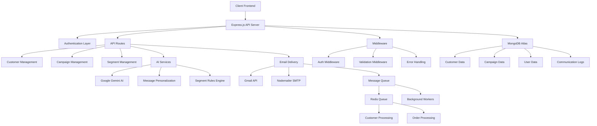

# CRM Backend

A comprehensive Customer Relationship Management (CRM) backend system built with Node.js, TypeScript, and MongoDB. This system provides AI-powered customer segmentation, email campaign management, and automated messaging capabilities.

## 🏗️ Architecture


## Features
🔐 Google OAuth 2.0 Authentication
👥 Customer Management with data ingestion APIs
📦 Order Processing with pub-sub architecture
🎯 Dynamic Audience Segmentation with rule-based filtering
📧 Campaign Management with delivery tracking
🤖 AI Integration for natural language processing and message suggestions
📊 Real-time Analytics and delivery statistics
🔄 Queue-based Processing using BullMQ and Redis
📚 Comprehensive API Documentation with Swagger

## Tech Stack
- Runtime: Node.js with TypeScript
- Framework: Express.js
- Database: MongoDB with Mongoose
- Queue: BullMQ with Redis
- Authentication: Passport.js with Google OAuth
- Validation: Zod
- Documentation: Swagger/OpenAPI
- Testing: Jest
- Logging: Winston

## 🚀 Local Setup Instructions

### Prerequisites

- Node.js (v18 or higher)
- MongoDB Atlas account
- Redis server (optional, for queue processing)
- Google Cloud Console account (for Gmail API and Gemini AI)

### Installation

1. **Clone the repository**
   ```bash
   git clone <repository-url>
   cd CRM-backend
   ```

2. **Install dependencies**
   ```bash
   npm install
   ```

3. **Environment Configuration**
   
   Copy `config.local.json` to create your environment configuration:
   ```bash
   cp config.local.json .env
   ```
   
   Update the following environment variables in `.env`:
   ```env
   NODE_ENV=development
   PORT=4000
   MONGO_URI=your_mongodb_atlas_connection_string
   JWT_SECRET=your_jwt_secret_key
   REDIS_URL=redis://127.0.0.1:6379
   REDIS_ENABLED=1
   GOOGLE_CLIENT_ID=your_google_client_id
   GOOGLE_CLIENT_SECRET=your_google_client_secret
   GOOGLE_CALLBACK_URL=http://localhost:4000/api/auth/google/callback
   FRONTEND_URL=http://localhost:3000
   FRONTEND_DASHBOARD_URL=http://localhost:3000/dashboard
   FRONTEND_AUTH_CALLBACK_URL=http://localhost:3000/auth/callback
   ```

4. **Database Setup**
   - Create a MongoDB Atlas cluster
   - Update `MONGO_URI` with your connection string
   - The application will automatically create necessary collections

5. **Redis Setup (Optional)**
   - Install Redis locally or use a cloud Redis service
   - Update `REDIS_URL` with your Redis connection string
   - Set `REDIS_ENABLED=1` to enable queue processing

6. **Google API Setup**
   - Create a project in Google Cloud Console
   - Enable Gmail API and Google Generative AI API
   - Create OAuth 2.0 credentials
   - Update Google credentials in environment variables

7. **Start the application**
   ```bash
   # Development mode
   npm run dev
   
   # Production mode
   npm run start
   ```

8. **API Documentation**
   - Visit `http://localhost:4000/docs` for Swagger API documentation
   - Health check: `http://localhost:4000/health`

## 🤖 AI Tools and Technologies

### Core AI Features

1. **Google Gemini AI Integration**
   - **Natural Language to Segment Rules**: Convert human-readable descriptions into complex customer segmentation rules
   - **AI-Powered Message Generation**: Generate personalized email campaign messages based on goals
   - **Model**: Gemini 1.5 Flash for fast, cost-effective AI processing

2. **Message Personalization Engine**
   - Dynamic placeholder replacement (`{customerName}`, `{discount}`, etc.)
   - Customer data integration (spend, visits, last activity)
   - Template validation and error handling

3. **Smart Segment Rules Engine**
   - Complex rule combinations (AND/OR logic)
   - Date-based calculations (days since last activity)
   - Numeric and string field operations
   - Natural language fallback parsing

### Technology Stack

- **Backend Framework**: Express.js 5.1.0
- **Language**: TypeScript 5.9.2
- **Database**: MongoDB Atlas with Mongoose ODM
- **Queue System**: BullMQ with Redis
- **Authentication**: Passport.js with Google OAuth 2.0
- **Email Services**: Gmail API + Nodemailer
- **AI Services**: Google Generative AI (Gemini)
- **Validation**: Zod schema validation
- **Documentation**: Swagger/OpenAPI
- **Logging**: Winston logger
- **Security**: Helmet, CORS, Rate limiting

## 📊 Key Features

### Customer Management
- Customer CRUD operations
- Spend and visit tracking
- Activity monitoring
- Bulk import/export capabilities

### Campaign Management
- AI-generated campaign messages
- Personalized email campaigns
- Campaign performance tracking
- Delivery status monitoring

### Segmentation
- Natural language segment creation
- Complex rule-based filtering
- Dynamic segment population
- Real-time customer matching

### Email Delivery
- Gmail API integration
- SMTP fallback via Nodemailer
- Queue-based processing
- Delivery receipt tracking

### Analytics & Reporting
- Campaign performance metrics
- Customer engagement tracking
- Delivery success rates
- Communication logs

## 🔧 API Endpoints

### Authentication
- `POST /api/auth/google` - Google OAuth login
- `GET /api/auth/google/callback` - OAuth callback
- `POST /api/auth/verify` - Token verification

### Customers
- `GET /api/customers` - List customers
- `POST /api/customers` - Create customer
- `PUT /api/customers/:id` - Update customer
- `DELETE /api/customers/:id` - Delete customer
- `POST /api/customers/import` - Bulk import

### Campaigns
- `GET /api/campaigns` - List campaigns
- `POST /api/campaigns` - Create campaign
- `PUT /api/campaigns/:id` - Update campaign
- `POST /api/campaigns/:id/send` - Send campaign

### Segments
- `GET /api/segments` - List segments
- `POST /api/segments` - Create segment
- `POST /api/segments/ai-create` - AI-powered segment creation

### AI Services
- `POST /api/ai/parse-segment` - Parse natural language to rules
- `POST /api/ai/generate-messages` - Generate campaign messages

## 📊 Database Schema

### Customers
```typescript
{
  name: string;
  email: string;
  phone?: string;
  spend?: number;
  visits?: number;
  last_active?: Date;
  created_at: Date;
}
```

### Orders
```typescript
{
  customer_id: ObjectId;
  amount: number;
  items: Array<{
    sku: string;
    name: string;
    qty: number;
    price: number;
  }>;
  date: Date;
}
```

### Segments
```typescript
{
  rules_json: RuleGroup;
  created_by: string;
  created_at: Date;
}
```

### Campaigns
```typescript
{
  segment_id: ObjectId;
  message: string;
  created_at: Date;
}
```

### Communication Logs
```typescript
{
  campaign_id: ObjectId;
  customer_id: ObjectId;
  status: 'SENT' | 'FAILED' | 'QUEUED';
  message: string;
  vendor_message_id?: string;
  sent_at?: Date;
  updated_at: Date;
}
```

### Segment Rules
The segmentation system supports complex rule-based filtering:

#### Basic Rules
```json
{
  "field": "spend",
  "op": ">",
  "value": 1000
}
```

#### Rule Groups
```json
{
  "and": [
    { "field": "spend", "op": ">", "value": 1000 },
    { "field": "visits", "op": "<", "value": 5 }
  ]
}
```

#### Supported Fields
- **spend** - Customer total spend
- **visits** - Number of visits
- **inactive_days** - Days since last activity

#### Supported Operators
- `>`, `>=`, `<`, `<=`, `==`, `!=`

### AI Features

#### Natural Language to Rules
Convert natural language queries to segment rules:

**Input:** "Users inactive for 6 months and spent > ₹5K"

**Output:**
```json
{
  "and": [
    { "field": "inactive_days", "op": ">", "value": 180 },
    { "field": "spend", "op": ">", "value": 5000 }
  ]
}
```

#### Message Suggestions
Generate campaign message templates based on goals:

**Input:** "win back inactive customers"

**Output:**
```json
[
  "Hi there! We miss you. win back inactive customers. Enjoy 15% off this week!",
  "It's been a while—win back inactive customers. Use code WELCOME10 for your next order.",
  "win back inactive customers. Special perk just for you: free shipping today only!"
]
```

### Queue Processing
The system uses BullMQ for asynchronous processing:

- **Customer Queue:** Processes customer data ingestion
- **Order Queue:** Processes order data ingestion
- **Workers:** Background workers process queued jobs

## ⚠️ Known Limitations and Assumptions

### Technical Limitations

1. **Database Dependencies**
   - Requires MongoDB Atlas (no local MongoDB support)
   - Database connection is required for most operations
   - Graceful degradation in development mode only

2. **Redis Queue System**
   - Queue processing requires Redis connection
   - Background workers won't function without Redis
   - Email delivery may be delayed if Redis is unavailable

3. **Google API Dependencies**
   - Gmail functionality requires valid Google OAuth tokens
   - AI features depend on Google Gemini API availability
   - API rate limits may affect high-volume operations

4. **Authentication**
   - Currently only supports Google OAuth
   - No built-in user registration system
   - JWT tokens have no built-in refresh mechanism

### Business Logic Assumptions

1. **Customer Data Model**
   - Assumes customers belong to a single user/organization
   - Spend and visit data expected to be numeric
   - Email addresses are unique per user scope

2. **Campaign Delivery**
   - Assumes Gmail as primary email provider
   - No built-in email template system
   - Limited to text and HTML email formats

3. **Segment Rules**
   - Date calculations assume UTC timezone
   - String operations are case-sensitive
   - Numeric comparisons don't handle currency formatting

4. **AI Integration**
   - AI responses may vary in quality
   - Fallback mechanisms in place for AI failures
   - No built-in AI response validation

### Performance Considerations

1. **Queue Processing**
   - Background workers process jobs sequentially
   - No horizontal scaling of workers
   - Memory usage grows with queue size

2. **Database Operations**
   - No connection pooling configuration
   - Limited indexing strategy
   - No query optimization for large datasets

3. **API Rate Limits**
   - Gmail API has daily sending limits
   - No built-in rate limiting for external APIs
   - Concurrent request handling may be limited

### Security Considerations

1. **Environment Variables**
   - Sensitive data stored in plain text config files
   - No encryption for stored credentials
   - JWT secret should be rotated regularly

2. **API Security**
   - CORS allows all origins in development
   - No request size limits beyond basic body parser
   - Limited input sanitization

## 🚀 Deployment

### Production Environment

1. **Environment Variables**
    
   - Use secure environment variable management
   - Rotate JWT secrets regularly
   - Use production-grade Redis and MongoDB instances

2. **Security Hardening**
   - Configure proper CORS origins
   - Enable HTTPS
   - Implement request rate limiting
   - Add input validation and sanitization

3. **Monitoring**
   - Set up application monitoring
   - Configure error tracking
   - Monitor queue processing
   - Track API usage and performance

### Scaling Considerations

- Implement horizontal scaling for workers
- Use Redis Cluster for high availability
- Consider database sharding for large datasets
- Implement caching for frequently accessed data

## 📝 Development

### Scripts

```bash
npm run dev          # Start development server
npm run build        # Build TypeScript
npm run start        # Start production server
npm run test         # Run tests
npm run lint         # Run ESLint
```

### Code Structure

```
src/
├── controllers/     # Request handlers
├── middleware/      # Express middleware
├── models/         # Database models
├── routes/         # API routes
├── services/       # Business logic
├── queues/         # Queue management
├── workers/        # Background workers
├── utils/          # Utility functions
└── config/         # Configuration
```

## 🤝 Contributing

1. Fork the repository
2. Create a feature branch
3. Make your changes
4. Add tests if applicable
5. Submit a pull request


## NOTE:
1. Make sure you included the correct environmental variables
2. Make sure that your ip address is listend in the MONGODB atlas, you can even make it default to all the networks, if the ip address you are youing is not listed in the MongoDB atlas then you cannot connect to the database.